# OCR Identity REST API v2.0.0

A modern, scalable REST API for OCR identity document processing with S3 storage, database metadata management, and background task processing using Celery.

## Table of Contents
- [Features](#features)
- [Architecture Overview](#architecture-overview)
- [Entity Relationship Diagram (ERD)](#entity-relationship-diagram-erd)
- [Prerequisites](#prerequisites)
- [Quick Start](#quick-start)
- [Docker Hub](#docker-hub)
- [Logging](#logging)
- [CI/CD Pipeline](#cicd-pipeline)
- [Multi-Database Setup](#multi-database-setup)
- [Configuration](#configuration)
- [API Endpoints](#api-endpoints)
- [Background Processing](#background-processing)
- [Docker Services](#docker-services)
- [Development](#development)
- [Monitoring](#monitoring)
- [Security](#security)
- [Production Deployment](#production-deployment)
- [Changelog](#changelog)
- [Contributing](#contributing)
- [License](#license)
- [Support](#support)

## 🚀 Features

### Core Functionality
- **OCR Processing**: Extract text from identity documents (passports, ID cards, driver licenses)
- **spaCy NER**: Advanced Named Entity Recognition for accurate information extraction
- **S3 Storage**: Secure file storage with MinIO (S3-compatible)
- **Multi-Database Support**: Connect to multiple databases with automatic routing
- **Database Metadata**: PostgreSQL with comprehensive media management
- **Background Processing**: Celery workers for async OCR and media processing
- **Polymorphic Media**: Flexible media relationships across models
- **REST API**: FastAPI with automatic documentation

### Architecture
- **Microservices**: Docker containers for each service
- **Queue-based Processing**: Redis-backed Celery for background tasks
- **Object Storage**: S3-compatible storage with MinIO
- **Multi-Database**: PostgreSQL 17 with support for multiple databases
- **Database Routing**: Automatic model routing to appropriate databases
- **Caching**: Redis for session and task management
- **Email Testing**: Mailpit for development email testing
- **Dependency Management**: Poetry for modern Python packaging

## 🏗️ Architecture Overview

```
┌─────────────────┐    ┌─────────────────┐    ┌─────────────────┐
│   FastAPI App   │    │  Celery Workers │    │   PostgreSQL    │
│   (Port 8000)   │    │  (OCR/Media)    │    │   (Port 5432)   │
└─────────────────┘    └─────────────────┘    └─────────────────┘
         │                       │                       │
         │                       │                       │
         ▼                       ▼                       ▼
┌─────────────────┐    ┌─────────────────┐    ┌─────────────────┐
│   MinIO (S3)    │    │     Redis       │    │    Mailpit      │
│  (Port 9000)    │    │   (Port 6379)   │    │   (Port 8025)   │
└─────────────────┘    └─────────────────┘    └─────────────────┘
```

## 🗂️ Entity Relationship Diagram (ERD)

<p align="center">
  
</p>

## 📋 Prerequisites

- Docker and Docker Compose
- Python 3.11+ (for local development)
- Poetry (for dependency management)
- Git

## 🚀 Quick Start

### 1. Clone and Setup
```bash
git clone git@github.com:turahe/ocr-identity-rest-api.git
cd ocr-identity-rest-api
```

### 2. Install Poetry (if not installed)
```bash
# Install Poetry
curl -sSL https://install.python-poetry.org | python3 -

# Or using pip
pip install poetry
```

### 3. Environment Configuration
```bash
# Copy environment template
cp config.example.env .env

# Edit environment variables
nano .env
```

### 4. Install Dependencies
```bash
# Install all dependencies (including dev)
poetry install

# Or install only production dependencies
poetry install --only=main
```

### 5. Start Services
```bash
# Navigate to docker directory
cd docker

# Start development environment
./start-dev.sh

# Or use Docker Compose directly
docker-compose up -d

# View logs
docker-compose logs -f

# Check service status
docker-compose ps
```

### 6. Initialize Database and Models
```bash
# Run migrations
poetry run alembic upgrade head

# Create MinIO bucket
poetry run python scripts/setup_minio.py

# Download spaCy models
poetry run python scripts/download_spacy_models.py
```

### 7. Access Services
- **API**: http://localhost:8000
- **API Docs**: http://localhost:8000/docs
- **MinIO Console**: http://localhost:9001
- **Mailpit**: http://localhost:8025

## 🐳 Docker Hub

The project includes scripts and commands for building and uploading Docker images to Docker Hub.

### Docker Hub Upload Script

The `scripts/docker-hub-upload.sh` script provides a complete workflow for building and uploading Docker images:

```bash
# Basic usage
./scripts/docker-hub-upload.sh

# With version and turahe
./scripts/docker-hub-upload.sh 2.0.0 your-turahe

# Show help
./scripts/docker-hub-upload.sh --help
```

### Makefile Commands

```bash
# Login to Docker Hub
make docker-hub-login

# Build images for Docker Hub
make docker-hub-build

# Upload images to Docker Hub
make docker-hub-upload VERSION=2.0.0 turahe=your-turahe

# Push images to Docker Hub
make docker-hub-push VERSION=2.0.0 turahe=your-turahe
```

### Environment Variables

```bash
# Set Docker Hub password (optional, will prompt if not set)
export DOCKER_PASSWORD="your-dockerhub-password"
```

### Image Tags Created

The script creates multiple tags for each upload:

- `turahe/ocr-identity-api:version` - Production image with specific version
- `turahe/ocr-identity-api:latest` - Latest production image
- `turahe/ocr-identity-api:version-dev` - Development image with specific version
- `turahe/ocr-identity-api:latest-dev` - Latest development image
- `turahe/ocr-identity-api:vversion` - Versioned tag (if version != latest)
- `turahe/ocr-identity-api:vversion-dev` - Versioned development tag

### Features

- **Authentication**: Automatic Docker Hub login with password prompt
- **Multi-target builds**: Builds both production and development images
- **Version tagging**: Creates multiple version tags automatically
- **Error handling**: Comprehensive error checking and reporting
- **Cleanup options**: Optional local image cleanup after upload
- **Colored output**: Clear, colored status messages

### Usage Examples

```bash
# Upload latest version
./scripts/docker-hub-upload.sh latest myturahe

# Upload specific version
./scripts/docker-hub-upload.sh 2.0.0 myturahe

# Upload with environment variable
export DOCKER_PASSWORD="mypassword"
./scripts/docker-hub-upload.sh 2.0.0 myturahe
```

## 📊 Logging

The application includes comprehensive logging with structured output, multiple handlers, and environment-specific configurations.

## 🔄 CI/CD Pipeline

The project includes comprehensive GitHub Actions workflows for automated testing, building, and deployment.

<p align="center">
  
</p>

### Workflows Overview

#### 1. CI/CD Pipeline (`ci-cd.yml`)
- **Triggers**: Push to main/develop, Pull requests, Release published
- **Features**: Testing, linting, Docker building, automated deployment
- **Jobs**: Test & Quality Checks, Security Scan, Docker Build, Deploy

#### 2. Manual Deploy (`deploy.yml`)
- **Triggers**: Manual workflow dispatch
- **Purpose**: Manual deployment to staging or production
- **Features**: Environment selection, version specification, health checks

#### 3. Release (`release.yml`)
- **Triggers**: Release published
- **Features**: Release asset creation, Docker image versioning
- **Jobs**: Build Release Assets, Docker Release

#### 4. Security Scan (`security.yml`)
- **Triggers**: Weekly schedule, Manual dispatch, Push to main/develop
- **Features**: Comprehensive security scanning, vulnerability checks
- **Jobs**: Security Analysis, Dependency Scan, Container Scan

#### 5. Documentation (`docs.yml`)
- **Triggers**: Changes to docs/, Manual dispatch
- **Features**: Documentation building, link validation, GitHub Pages deployment
- **Jobs**: Build Documentation, Check Links, Deploy Docs

### Required Secrets

```bash
# Docker Hub
DOCKER_turahe=your-docker-turahe
DOCKER_PASSWORD=your-docker-password

# Production Environment
PRODUCTION_HOST=your-production-server-ip
PRODUCTION_turahe=your-production-turahe
PRODUCTION_SSH_KEY=your-production-ssh-private-key
PRODUCTION_URL=https://your-production-domain.com

# Staging Environment
STAGING_HOST=your-staging-server-ip
STAGING_turahe=your-staging-turahe
STAGING_SSH_KEY=your-staging-ssh-private-key
STAGING_URL=https://your-staging-domain.com

# Security Tools
SNYK_TOKEN=your-snyk-token
```

### Usage Examples

#### Manual Deployment
1. Go to Actions tab in GitHub
2. Select "Manual Deploy" workflow
3. Choose environment (staging/production)
4. Optionally specify Docker image version
5. Click "Run workflow"

#### Creating a Release
1. Create a new release in GitHub
2. Tag with semantic version (e.g., v2.0.0)
3. Publish the release
4. Workflows automatically build assets and Docker images

For detailed workflow documentation, see [`.github/workflows/README.md`](.github/workflows/README.md).

### Log Files

- **app.log**: General application logs
- **error.log**: Error and exception logs
- **access.log**: API request/response logs
- **app.json**: JSON-formatted logs (production only)

### Log Levels

- **DEBUG**: Detailed information for debugging
- **INFO**: General application information
- **WARNING**: Warning messages
- **ERROR**: Error messages and exceptions
- **CRITICAL**: Critical system errors

### Logging Commands

```bash
# Setup logging
make setup-logging

# View logs in real-time
make view-logs          # Application logs
make view-errors        # Error logs
make view-access        # Access logs

# Log management
make clean-logs         # Clean all log files
make log-stats          # Show log file statistics
```

### API Logging Endpoints

```bash
# Get list of log files
GET /logging/logs

# View log content
GET /logging/logs/{filename}?lines=100

# Download log file
GET /logging/logs/{filename}/download

# Get log statistics
GET /logging/stats

# Clear all logs (admin only)
POST /logging/clear
```

### Logging Features

- **Structured Logging**: JSON format in production
- **Colored Output**: Colored console output in development
- **Log Rotation**: Automatic log file rotation (10MB max, 5 backups)
- **Request Tracking**: Request IDs for tracing
- **Performance Monitoring**: Request timing and performance metrics
- **Service Logging**: Dedicated loggers for S3, Redis, Email, Celery
- **Database Logging**: SQL query logging and performance tracking

### Environment-Specific Logging

- **Development**: Colored console output, DEBUG level
- **Staging**: Standard output, INFO level
- **Production**: JSON format, INFO level, file rotation

## 🗄️ Multi-Database Setup

The application supports connecting to multiple databases with automatic model routing.

### Quick Multi-Database Setup

```bash
# Use multi-database configuration
cp config.multi_db.example.env .env

# Start multi-database services
./start-multi-db.sh

# Test multi-database functionality
poetry run python scripts/test_multi_database.py
```

### Multi-Database Features

- **Database Routing**: Models automatically routed to appropriate databases
- **Health Monitoring**: Monitor all database connections
- **Statistics**: Get detailed statistics for each database
- **Query Execution**: Execute queries on specific databases
- **Backup Information**: Get backup information for all databases

### Database Types

- **Default**: Main application data (User, People, Media, etc.)
- **Analytics**: Analytics and reporting data
- **Logging**: Application logs and audit data
- **Archive**: Archived and historical data

### API Endpoints

```bash
# Health check all databases
curl -H "Authorization: Bearer YOUR_TOKEN" http://localhost:8000/database/health

# Get database statistics
curl -H "Authorization: Bearer YOUR_TOKEN" http://localhost:8000/database/stats

# Get configured databases
curl -H "Authorization: Bearer YOUR_TOKEN" http://localhost:8000/database/configured
```

For detailed multi-database documentation, see [docs/MULTI_DATABASE.md](docs/MULTI_DATABASE.md).

## 🔧 Configuration

### Environment Variables

#### Database
```env
DB_HOST=postgres
DB_PORT=5432
DB_turahe=postgres
DB_PASSWORD=postgres
DB_NAME=ocr_identity_db
```

#### Redis
```env
REDIS_HOST=redis
REDIS_PORT=6379
REDIS_PASSWORD=
```

#### S3/MinIO
```env
AWS_ACCESS_KEY_ID=minioadmin
AWS_SECRET_ACCESS_KEY=minioadmin
AWS_REGION=us-east-1
S3_BUCKET_NAME=ocr-identity-bucket
S3_ENDPOINT_URL=http://minio:9000
S3_USE_SSL=false
S3_VERIFY_SSL=false
```

#### Application
```env
SECRET_KEY=your-secret-key-change-in-production
DEBUG=false
ENVIRONMENT=development
```

## 📡 API Endpoints

### File Upload & Processing

#### Upload Image (Async)
```http
POST /upload-image/
Content-Type: multipart/form-data

file: [image file]
user_id: [optional]
```

**Response:**
```json
{
  "status": "uploading",
  "task_id": "abc123-def456",
  "filename": "passport.jpg",
  "content_type": "image/jpeg",
  "message": "File upload started. Use task_id to check status."
}
```

#### Upload Image (Sync)
```http
POST /upload-image-sync/
Content-Type: multipart/form-data

file: [image file]
user_id: [optional]
```

**Response:**
```json
{
  "status": "success",
  "media_id": "uuid-here",
  "s3_key": "uploads/abc123.jpg",
  "s3_url": "http://minio:9000/bucket/uploads/abc123.jpg",
  "file_hash": "abc123...",
  "file_size": 1024000,
  "ocr_task_id": "def456-ghi789",
  "message": "File uploaded and OCR processing started"
}
```

### Task Management

#### Get Task Status
```http
GET /task/{task_id}
```

**Response:**
```json
{
  "task_id": "abc123-def456",
  "state": "SUCCESS",
  "result": {
    "status": "success",
    "media_id": "uuid-here",
    "ocr_job_id": "job-uuid",
    "extracted_text": "PASSPORT...",
    "processing_time_ms": 1500
  }
}
```

### Media Management

#### Get Media Information
```http
GET /media/{media_id}
```

#### Get OCR Results
```http
GET /media/{media_id}/ocr
```

#### Delete Media
```http
DELETE /media/{media_id}
```

### Health Check
```http
GET /health
```

## 🔄 Background Processing

### Celery Workers

#### OCR Worker
```bash
# Start OCR worker
poetry run python scripts/start_celery_worker.py --worker --queue ocr --concurrency 2
```

#### Media Worker
```bash
# Start media worker
poetry run python scripts/start_celery_worker.py --worker --queue media --concurrency 4
```

#### Beat Scheduler
```bash
# Start beat scheduler
poetry run python scripts/start_celery_worker.py --beat
```

### Task Types

#### OCR Tasks
- `process_ocr_image`: Process single image OCR
- `process_bulk_ocr`: Process multiple images
- `cleanup_failed_ocr_jobs`: Clean up failed jobs

#### Media Tasks
- `upload_media_to_s3`: Upload file to S3
- `process_media_batch`: Process multiple files
- `cleanup_orphaned_media`: Clean up orphaned records
- `generate_media_thumbnails`: Generate image thumbnails

## 🐳 Docker Services

### Optimized Docker Structure
The project now uses an optimized Docker setup with environment-specific configurations:

```
docker/
├── docker-compose.yml          # Main configuration
├── docker-compose.dev.yml      # Development overrides
├── docker-compose.staging.yml  # Staging overrides
├── docker-compose.prod.yml     # Production overrides
├── docker-compose.multi-db.yml # Multi-database setup
├── start-dev.sh               # Development startup script
└── README.md                  # Docker documentation
```

### Core Services
- **app**: FastAPI application
- **postgres**: PostgreSQL 17 database
- **redis**: Redis cache and message broker
- **minio**: S3-compatible object storage
- **mailpit**: Email testing service

### Celery Services
- **celery_worker_ocr**: OCR processing worker
- **celery_worker_media**: Media processing worker
- **celery_beat**: Task scheduler

### Environment-Specific Features
- **Development**: Hot reload, debug mode, reduced resources
- **Staging**: Testing optimizations, separate ports
- **Production**: High performance, security optimizations
- **Multi-Database**: Separate databases for different purposes

## 🛠️ Development

### Local Development
```bash
# Install development dependencies
poetry install

# Run migrations
poetry run alembic upgrade head

# Start services
docker compose up -d postgres redis minio

# Run application
poetry run uvicorn main:app --host 0.0.0.0 --port 8000 --reload
```

### Using Makefile
```bash
# Show all available commands
make help

# Quick development setup
make dev-setup

# Quick start with Docker
make quick-start

# Run tests
make test

# Code quality checks
make check
```

### Using Docker Commands
```bash
# Development environment
cd docker && ./start-dev.sh

# Staging environment
cd docker && ./start-staging.sh

# Production environment
cd docker && ./start-prod.sh

# Multi-database setup
cd docker && docker-compose -f docker-compose.yml -f docker-compose.multi-db.yml up -d

# View logs
docker-compose logs -f

# Stop services
docker-compose down
```

### Poetry Commands
```bash
# Install dependencies
poetry install

# Add new dependency
poetry add package-name

# Add development dependency
poetry add --group dev package-name

# Update dependencies
poetry update

# Run commands in Poetry environment
poetry run python main.py
poetry run pytest
poetry run black app/

# Activate Poetry shell
poetry shell
```

### Testing
```bash
# Run all tests
poetry run pytest

# Run with coverage
poetry run pytest --cov=app --cov-report=html

# Run specific test categories
poetry run pytest tests/test_media_models.py
poetry run pytest tests/test_ocr_tasks.py
poetry run pytest tests/test_integration.py
```

### Code Quality
```bash
# Format code
poetry run black app/ tests/ scripts/
poetry run isort app/ tests/ scripts/

# Lint code
poetry run flake8 app/ tests/ scripts/

# Type checking
poetry run mypy app/ scripts/
```

## 📊 Monitoring

### Task Monitoring
```bash
# Check Celery worker status
poetry run celery -A app.core.celery_app inspect active

# Monitor task queues
poetry run celery -A app.core.celery_app inspect stats
```

### Database Monitoring
```bash
# Connect to database
docker compose exec postgres psql -U postgres -d ocr_identity_db

# Check media records
SELECT COUNT(*) FROM media;

# Check OCR jobs
SELECT job_status, COUNT(*) FROM ocr_jobs GROUP BY job_status;
```

### S3/MinIO Monitoring
- Access MinIO Console: http://localhost:9001
- Default credentials: minioadmin/minioadmin
- Check bucket contents and access logs

## 🔒 Security

### File Upload Security
- File size limits (configurable)
- File type validation
- Hash-based deduplication
- Secure S3 access with presigned URLs

### Database Security
- Connection pooling
- Prepared statements
- Soft delete for data retention
- Audit logging

### API Security
- Input validation
- Error handling
- Rate limiting (configurable)
- CORS configuration

## 🚀 Production Deployment

### Environment Setup
```bash
# Production environment
ENVIRONMENT=production
DEBUG=false
SECRET_KEY=<strong-secret-key>

# Database
DB_PASSWORD=<strong-password>
REDIS_PASSWORD=<strong-password>

# S3 (AWS or other provider)
AWS_ACCESS_KEY_ID=<your-access-key>
AWS_SECRET_ACCESS_KEY=<your-secret-key>
S3_BUCKET_NAME=<your-bucket>
```

### Scaling
```bash
# Scale workers
docker compose up -d --scale celery_worker_ocr=3 --scale celery_worker_media=2

# Scale application
docker compose up -d --scale app=3
```

### Monitoring
- Set up logging aggregation
- Configure health checks
- Monitor resource usage
- Set up alerting

## 📝 Changelog

### v2.0.0
- **S3 Storage**: Replaced local file storage with S3/MinIO
- **Database Metadata**: Added comprehensive media management
- **Background Processing**: Implemented Celery for async tasks
- **Polymorphic Media**: Added flexible media relationships
- **API Enhancement**: New endpoints for task and media management
- **Docker Optimization**: Multi-service architecture with Celery workers
- **Poetry Migration**: Modern dependency management with Poetry

### v1.0.0
- Basic OCR functionality
- Local file storage
- Simple REST API

## 🤝 Contributing

1. Fork the repository
2. Create a feature branch
3. Make your changes
4. Add tests
5. Submit a pull request

## 📄 License

This project is licensed under the MIT License - see the [LICENSE](LICENSE) file for details.

## 🆘 Support

For support and questions:
- Create an issue on GitHub
- Check the documentation
- Review the API documentation at `/docs`

---

**Note**: This is a production-ready OCR identity document processing API with modern architecture, scalable design, and comprehensive testing. The system is designed to handle high-volume document processing with background task management and secure file storage.

